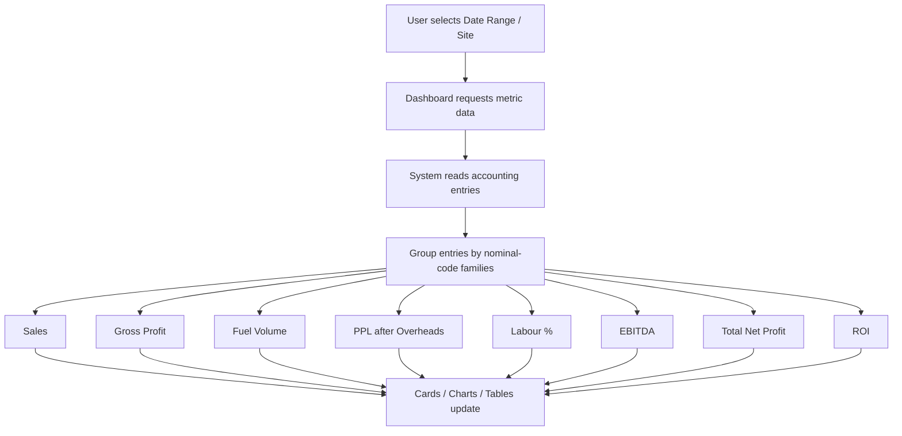
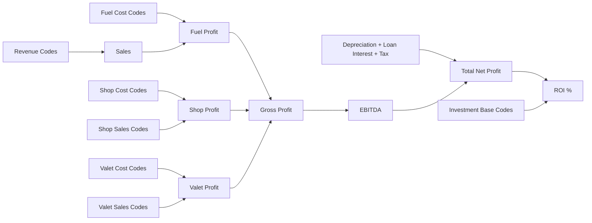

# Dashboard Metrics Workflow (Simple Version)

This document explains how dashboard numbers are created in plain language.
It is written for non-technical team members.

---

## Visual Workflow Chart

### Metric Calculation Flow (Add/Subtract)

---

## 1) How data reaches the dashboard

1. User selects a date range and (optionally) site(s).
2. The dashboard asks the system for values.
3. The system reads accounting entries for that date range.
4. Entries are grouped by category (fuel, shop, valet, labour, overheads, tax, etc.).
5. Totals are calculated and shown in cards/charts/tables.

---

## 2) What each key metric means

## Sales
- Total income from fuel + shop + valet categories.
- Shown in site cards and comparison tables.

## Gross Profit
- Sales minus direct costs (fuel/shop/valet costs).
- Presented per site and as combined totals.

## Fuel Volume
- Litres sold from fuel sales records.
- Shown as total volume and volume by site.

## PPL (after overheads)
- Profit per litre after overhead impact.
- Used to compare site operating efficiency.

## Labour %
- Labour cost compared to relevant sales base.
- Indicates staffing cost pressure.

## EBITDA
- Operating earnings before depreciation, loan interest, and corporation tax.
- Used as a core operating performance number.

## Total Net Profit
- EBITDA minus depreciation, loan interest, and corporation tax.
- Final profitability figure shown on the dashboard.

## ROI
- Return based on net profit versus investment base.
- Used in summary cards and monthly trend view.

---

## 2A) Nominal codes used (Add / Subtract view)

This section is for accounting review. It shows which nominal codes are added or subtracted in each figure.

## Total Site Revenue (Sales card)
- Add:
  - Fuel sales: `4000, 4001, 4002, 4003, 4004`
  - Bunkering additions: `4100, 4101, 4102`
  - Shop sales: `4032, 4034, 4036, 4037, 5035`
  - Valet sales: `4028, 4029, 4030, 4031, 4017`
- Subtract: none at this stage (gross revenue view).

## Fuel Gross Profit (fuel part only)
- Add (revenue side): `4000, 4001, 4002, 4003, 4004, 4100, 4101, 4102`
- Subtract (cost side): `5000, 5001, 5002, 5003, 5004, 5005, 5041, 5050`

## Shop Profit
- Add (shop sales): `4032, 4034, 4036, 4037, 5035`
- Subtract (shop cost): `5032, 5033, 5034, 5036, 5037, 5042`

## Valet Profit
- Add (valet sales): `4028, 4029, 4030, 4031, 4017`
- Subtract (valet cost): `5015, 5028, 5029, 5030, 5031, 5043, 5044`

## Gross Profit (card-level total shown to users)
- Formula used in dashboard:
  - `Gross Profit = Fuel Profit + Shop Profit + Valet Profit`
- So effectively:
  - Add: all fuel/shop/valet sales groups above
  - Subtract: all fuel/shop/valet cost groups above

## Fuel Volume
- Volume extraction from fuel sales lines only:
  - `4000, 4001, 4002, 4003, 4004`
- Volume is taken from transaction details text (litres), not from cost codes.

## PPL (after overheads)
- Base profit comes from fuel profit groups (same logic as fuel profit).
- Overhead/labour impact applied using overhead + wage code groups.
- Key overhead/labour group includes:
  - Labour family: `7000, 7001, 7002, 7003, 7005`
  - Additional wage/overhead adjustments: `7006, 7007, 7008, 7010`
  - Overheads set (rent, utilities, insurance, maintenance, etc.) as configured in system.

## Labour %
- Labour-focused codes:
  - `7000, 7001, 7002, 7003, 7005`
- Used to show labour burden against sales context.

## EBITDA
- Operating result before depreciation, loan interest, corporation tax.
- Includes operating revenue and cost groups plus misc income.
- Misc income group:
  - `4400, 4401, 4402, 4404, 4405, 4407, 4410, 4412, 4413, 4415, 4416, 4417, 4418`

## Total Net Profit
- Formula:
  - `Total Net Profit = EBITDA - Depreciation - Loan Interest - Corporation Tax`
- Subtract groups:
  - Depreciation: `8200, 8201, 8202, 8203, 8204, 8206, 8207`
  - Loan interest: `7750, 7705, 7752, 7753`
  - Corporation tax: `9000`

## ROI
- Formula:
  - `ROI % = (Total Net Profit / Investment Base) x 100`
- Investment base codes:
  - `0010, 0030, 0034, 0040, 0050, 0060, 0070`

---

## 2B) Code + Label Matrix (Accounting Friendly)

Below is the same logic in detailed accountant format: code, label, and treatment.

## A) Sales (Add)
- `4000` Petrol Unleaded (Add)
- `4001` Diesel Unleaded (Add)
- `4002` Petrol Super Unleaded (Add)
- `4003` Diesel Super Unleaded (Add)
- `4004` Adblue (Add)
- `4100` Bunkering Charges (BP Commission) (Add)
- `4101` Bunkered Sales (Add)
- `4102` Bunkered Commission (Add)
- `4032` E-Pay Sales (Add)
- `4034` Paypoint/Keycharge Sales (Add)
- `4036` Lottery Online (Add)
- `4037` Lottery Instants (Add)
- `5035` Paypoint/Keycharge Commissions (Add)
- `4028` Car Wash (Add)
- `4029` Jet Wash (Add)
- `4030` Car Vac (Add)
- `4031` Car Airline (Add)
- `4017` Hot Food/Costa (Add)

## B) Fuel Gross Profit
### Fuel Revenue (Add)
- `4000` Petrol Unleaded
- `4001` Diesel Unleaded
- `4002` Petrol Super Unleaded
- `4003` Diesel Super Unleaded
- `4004` Adblue
- `4100` Bunkering Charges (BP Commission)
- `4101` Bunkered Sales
- `4102` Bunkered Commission

### Fuel Cost (Subtract)
- `5000` Petrol Unleaded
- `5001` Diesel Unleaded
- `5002` Petrol Super Unleaded
- `5003` Diesel Super Unleaded
- `5004` Adblue
- `5005` Fuel Promotional
- `5041` Fuel Commission
- `5050` Stock Movement

## C) Shop Profit
### Shop Sales (Add)
- `4032` E-Pay Sales
- `4034` Paypoint/Keycharge Sales
- `4036` Lottery Online
- `4037` Lottery Instants
- `5035` Paypoint/Keycharge Commissions

### Shop Cost (Subtract)
- `5032` E-Pay Purchases
- `5033` E-Pay Commission
- `5034` Paypoint/Keycharge Purchases
- `5036` Lottery Online
- `5037` Lottery Instants
- `5042` Lottery (Instant+Online) Commission

## D) Valet Profit
### Valet Sales (Add)
- `4028` Car Wash
- `4029` Jet Wash
- `4030` Car Vac
- `4031` Car Airline
- `4017` Hot Food/Costa

### Valet Cost (Subtract)
- `5015` Hot Food/Costa
- `5028` Car Wash
- `5029` Jet Wash
- `5030` Car Vac
- `5031` Car Airline
- `5043` Valet Commission
- `5044` Coffee Commission

## E) Fuel Volume Source Codes
- `4000` Petrol Unleaded (Volume source from details)
- `4001` Diesel Unleaded (Volume source from details)
- `4002` Petrol Super Unleaded (Volume source from details)
- `4003` Diesel Super Unleaded (Volume source from details)
- `4004` Adblue (Volume source from details)

## F) Labour / Overheads (used in PPL-after-overheads and labour analysis)
### Labour family
- `7000` Gross Wages
- `7001` Employers N.I. - Staff
- `7002` Directors Salaries
- `7003` Employers N.I. - Directors
- `7005` Directors Pensions

### Wage/adjustment add-ons
- `7006` Adjustments
- `7007` SSP Reclaimed
- `7008` SMP Reclaimed
- `7010` Commission Paid to Site Operators

### Main overhead examples (all treated as cost/subtract effect)
- `7150` Rent
- `7151` Rates
- `7152` Water
- `7200` Light & Heat
- `7250` Premises Insurance
- `7600` General Repairs & Maintenance
- `7602` Pumps & Tills Contracted
- `7604` Fire Protection & Security Costs
- `7605` Cash Collection Security
- `7906` Credit Card Charges

## G) EBITDA adjustments (other operating income used by dashboard)
- `4400` Marketing Services Income (Add)
- `4401` ATM Cash Machine Income Received (Add)
- `4402` Rebates (Income) (Add)
- `4404` Commissions Received (Add)
- `4407` Rental Income (Add)
- `4410` Misc Income - ALL HEAD OFFICE (Add)
- `4412` Ast-Costa Coffee Rent (Add)
- `4413` EV Rent/Revenue (Add)
- `4415` Bank Interest Income (Add)
- `4416` ByBox Income (Add)
- `4417` Amazon Locker rent (Add)
- `4418` Euro Car Parks Rebate (Add)

## H) Total Net Profit Deductions
### Depreciation (Subtract)
- `8200` Depreciation Motor Vehicles
- `8201` Depreciation Leasehold L&B
- `8202` Depreciation Freehold Land & Building
- `8203` Depreciation Plant & Machinery
- `8204` Depreciation Fixtures & Fittings
- `8206` Depreciation Other assets
- `8207` Depreciation Site Development & Improvement

### Loan/Finance related (Subtract)
- `7750` Loan Interest Paid
- `7705` Overdraft Interest
- `7752` Arrangement Fees
- `7753` Guarantee Fees

### Tax (Subtract)
- `9000` Corporation Tax Charge

## I) ROI Investment Base
- `0010` Motor Vehicles
- `0030` Freehold Land & Buildings-Cost
- `0034` Site Development & Improvement
- `0040` Plant & Machinery - Cost
- `0050` Fixture & Fitting
- `0060` Other Assets
- `0070` Investment Property

---

## 3) Breakdown sections (what they show)

## Volume by site
- Shows site-wise fuel volume.
- Only meaningful non-zero sites are shown.
- Head Office is kept visible as requested.

## Shop / Valet breakdowns
- Shows category contribution and share (%).
- Labels are business-friendly (without technical nominal code display in main lists).

## Profit breakdowns
- Splits totals into revenue, cost, depreciation, interest, and tax impact.

---

## 4) Site list logic

Some pages show only active fuel-performing sites (for fair comparison),
while other breakdowns may still include sites with zero values for completeness.

This is why one table can show 14 active sites while another list can show more names.

---

## 5) Verification and access workflow (simple)

- Admin creates users.
- Users should verify account before login.
- Admin can resend verification.
- Admin can also manually verify a user when needed.
- Admin can open dashboard directly from admin page.

---

## 6) Common confusion points

## "Why do two cards show different site counts?"
- One view is active-performance-focused.
- Another view is full-list or breakdown-focused.

## "Why did a value disappear?"
- Usually because selected date range/site filter has no matching entries.

## "Why are links sometimes not working outside office?"
- Public tunnel links change when restarted; update links and restart services.

---

## 7) Change policy for this document

Whenever metric logic is changed, update this file with:
- what changed,
- how business meaning changed,
- which dashboard sections are affected.

---

## 8) Main Dashboard - Complete Coverage

This section covers all major blocks visible on the main dashboard screen.

## A) Top Block - Quick Insights (KPI cards)

These cards are the first summary layer for selected date range/site filter.

1. **Total Site Revenue**
   - Business meaning: total sales from Fuel + Shop + Valet groups.
   - Code logic: all sales codes listed in sections 2A and 2B (sales add set).

2. **Total Fuel Volume**
   - Business meaning: total litres sold.
   - Code logic: volume extracted from fuel sales codes `4000-4004`.
   - Breakdown: Volume by categories and volume by site.

3. **PPL after Overheads**
   - Business meaning: net pence-per-litre after overhead burden.
   - Uses fuel profit plus overhead/labour logic.
   - If litres are unavailable in edge cases, system applies fallback margin logic.

4. **Gross Profit**
   - Business meaning: total trading profit.
   - Formula: `Fuel Profit + Shop Profit + Valet Profit`.

5. **Total Net Profit**
   - Business meaning: final profit after depreciation, interest, tax.
   - Formula: `EBITDA - Depreciation - Loan Interest - Corporation Tax`.

6. **Labour Cost %**
   - Business meaning: labour burden as percentage against sales context.
   - Labour family includes `7000,7001,7002,7003,7005` (+ adjustments in overhead context).

7. **EBITDA**
   - Business meaning: operating earnings before depreciation/interest/tax.
   - Includes operating revenue/cost + misc income set.

8. **ROI**
   - Business meaning: return on investment.
   - Formula: `(Total Net Profit / Investment Base) x 100`.

## B) Monthly Performance Trends (Bar Graph)

- What users see:
  - Monthly bars/lines for sales, profit, and fuel volume trend over time.
- Data basis:
  - Uses monthly grouped results for selected range/sites.
- Purpose:
  - trend direction, seasonality, and month-on-month view.

## C) PPL vs Actual PPL vending out OH

- What users see:
  - comparison between average PPL and overhead-adjusted actual PPL.
- Purpose:
  - explain impact of overhead burden on unit profitability.

## D) Shop Section

1. **Shop Sales** card
2. **Shop Profit** card
3. **Shop Sales Breakdown**
4. **Shop Cost Breakdown**

Code groups used:
- Sales add: `4032,4034,4036,4037,5035`
- Cost subtract: `5032,5033,5034,5036,5037,5042`

## E) Valeting Section

1. **Valet Sales** card
2. **Valeting Profit** card
3. **Valet Sales Breakdown**
4. **Valet Cost Breakdown**

Code groups used:
- Sales add: `4028,4029,4030,4031,4017`
- Cost subtract: `5015,5028,5029,5030,5031,5043,5044`

## F) ROI Section

1. **Site ROI Trend Over Time**
2. Comparison ROI view for sites in range

Investment base (denominator):
- `0010,0030,0034,0040,0050,0060,0070`

## G) Site Performance Tables

1. **Top Performing Sites**
2. **Sites Needing Improvement**

Displayed using selected KPI context (sales, profit, volume, PPL/ROI logic).

## H) Overheads Section

1. **Overhead Cost Breakdown**
2. **Monthly Overhead Cost Trends**
3. Optional deeper breakdown toggle ("More Overheads")

Used to explain:
- overhead composition,
- labour + overhead pressure,
- impact on PPL/net performance.

## I) Modal Breakdowns (View breakdown)

The dashboard opens drill-down modals for detailed review:

- Total Site Revenue breakdown
- Fuel Volume breakdown
- Gross Profit breakdown
- Shop Sales breakdown
- Shop Cost breakdown
- EBITDA breakdown
- PPL-after-overheads breakdown

These modals are where accountants can verify category-level contribution and code behavior.

## J) Add/Subtract Summary for Main Dashboard

- **Add side**: sales and income groups (fuel/shop/valet + misc income where applicable)
- **Subtract side**: purchases/cost groups, overheads, labour burden, depreciation, interest, tax
- **Final chain**:
  1. Revenue/Categories -> Gross Profit
  2. Gross Profit + Misc Income - Overheads -> EBITDA
  3. EBITDA - Depreciation - Interest - Tax -> Total Net Profit
  4. Total Net Profit / Investment Base -> ROI

## K) Why values differ across cards/tables

- KPI cards: headline totals
- Breakdown cards/modals: component-level split
- Trend charts: time-series aggregation
- Ranking tables: site-level comparison rules

Same base data, different aggregation level and presentation purpose.

