# HSRL Petroleum Dashboard — Visual Workflow

How data travels from the database to every card, chart, pie, and table on the dashboard.
Read each diagram **left → right**: *where the data lives* → *what we do to it* → *what the user sees*.
(Excludes login / admin / settings.)

---

## 1. The Big Picture

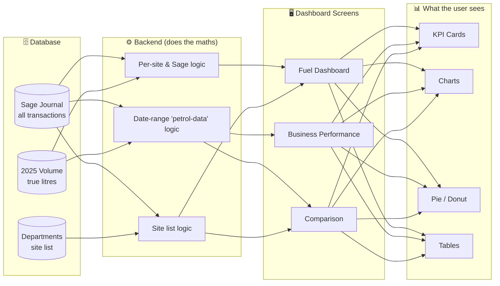

**The golden rule of this data:** every transaction is tagged with a **nominal code** (what kind of money it is) and a **site**. Almost every number on the dashboard is just *"pick the right codes, add them up, sometimes divide."*

---

## 2. The Money Buckets (nominal codes)

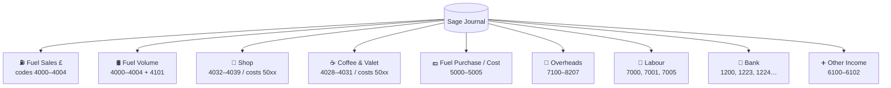

**Two rules to remember:**
- **Costs are stored as negative numbers.** So to subtract a cost you simply *add* it (sales `45` + cost `−37` = profit `8`). Never flip the sign yourself.
- **Code 4101 (bunkered) counts for litres only — never for £ sales.** If its note says *"reversal,"* the litres are subtracted, not added.

---

## 3. KPI Card Flows

### Fuel Volume → Net Sales → Profit (the core chain)

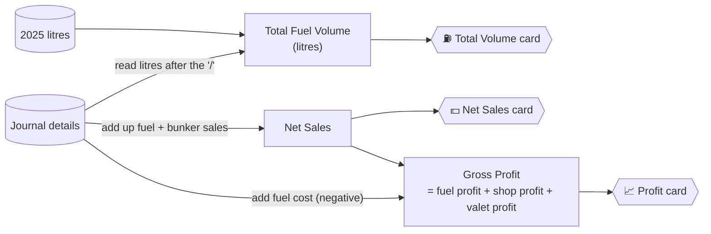

| Card | In plain words | Feeds |
|---|---|---|
| **Total Fuel Volume** | True litres: 2025 from the volume table, 2026+ read out of the transaction note. | PPL cards |
| **Net Sales** | Add up every revenue transaction for the chosen sites & dates. | Profit, Margin |
| **Gross Profit** | Fuel profit (sales − cost) **plus** shop profit **plus** valet profit. Shop/valet keep their sign so a loss pulls profit down. | PPL, Margin, ROI |

### Pence-Per-Litre family (profit spread over litres)

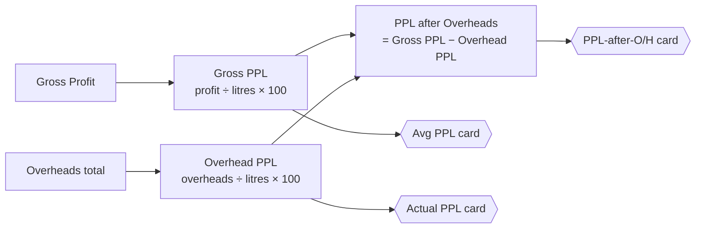

*Litres ("denom") = real volume when we have it, otherwise the fuel-sales £ as a stand-in.*

### Profit ladder (how one number rolls up to the next)

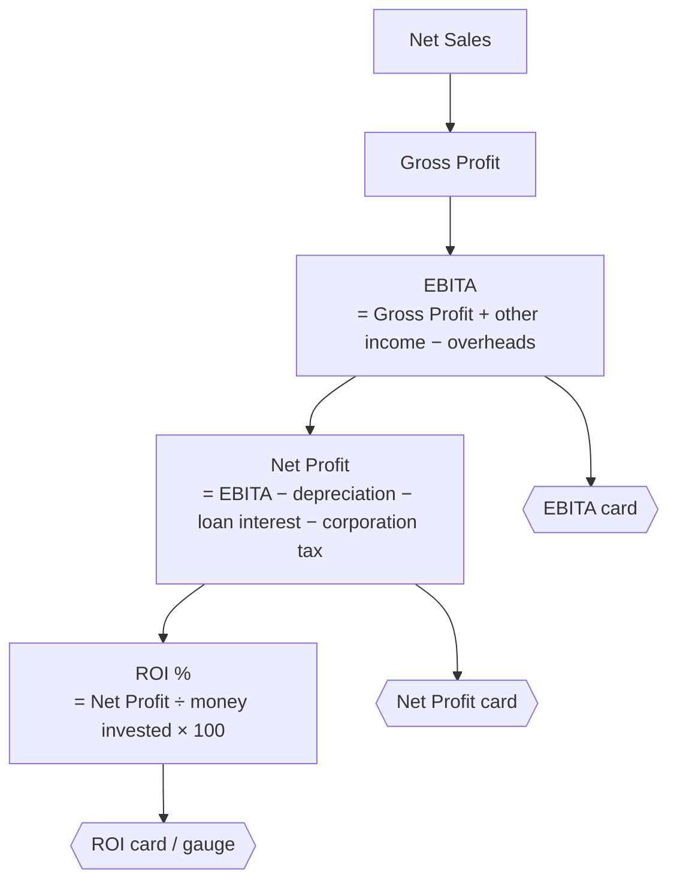

### Standalone cards

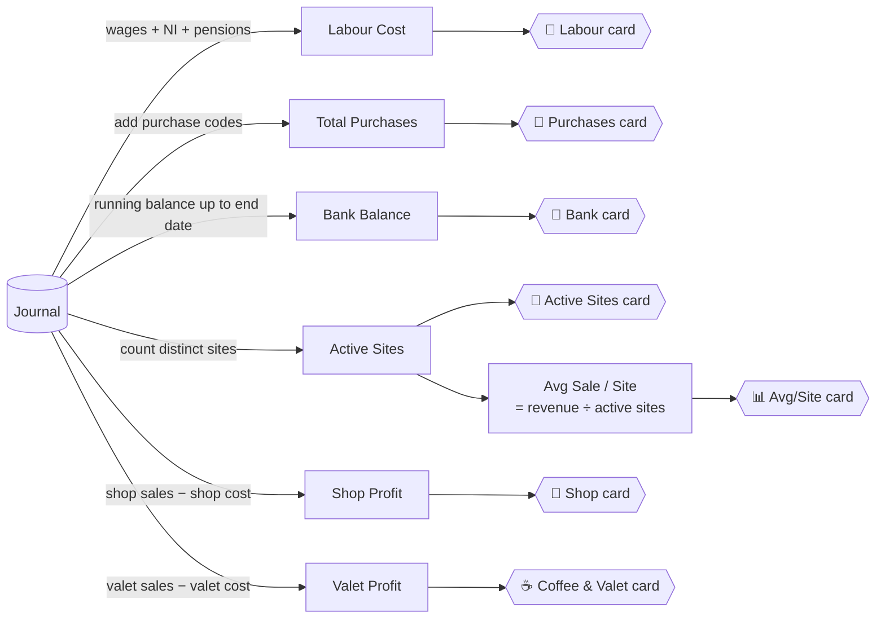

| Card | In plain words |
|---|---|
| **Profit Margin** | Profit as a % of revenue. |
| **Labour Cost** | Gross wages + employer NI + pensions. |
| **Bank Balance** | Running total of all bank movements up to the end date (closing position). |
| **Avg Sale / Site** | Total revenue split evenly across the active sites. |

> **Heads-up:** the *Bunkered / Non-Bunkered breakdown* cards on the petrol-data route currently return **zeros** (stub). The working version lives in the legacy dashboard modal. *Status cards* (debtors, creditors, discounts) are **hardcoded zeros** — no live calculation behind them yet.

---

## 4. Chart Flows

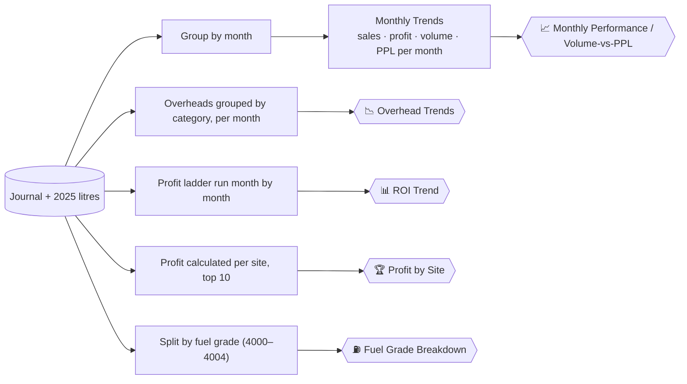

| Chart | What it shows |
|---|---|
| **Monthly Trends** | Sales, profit, litres, and PPL plotted month by month for the selected sites. |
| **PPL Comparison** | Gross PPL vs Actual PPL side by side. |
| **Overhead Trends** | Each overhead category as its own monthly line. |
| **ROI Trend** | The full profit ladder recalculated for every month. |
| **Profit by Site** | Each site's fuel profit, ranked, top 10. |
| **Fuel Grade / Volume Transition** | Litres (and £) broken out per fuel grade. |
| **Daily / Date-wise** | Revenue per day across the range. |

> **Decoration only (no live data):** PPI, Product Summary, Sales Summary, Shop Product Categories, Shop/Valet Margins, Valeting Categories, Orders Donut. These render sample/random numbers.

---

## 5. Pie & Donut Flows

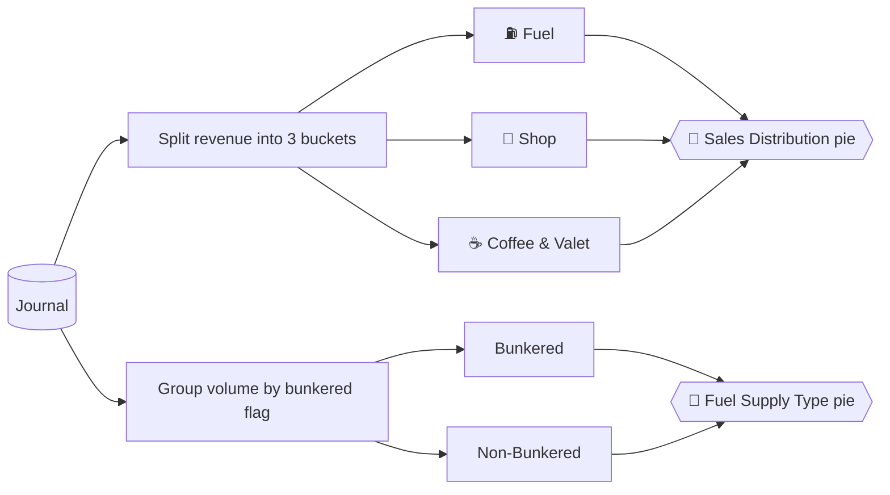

| Pie / Donut | Slices | How each slice is sized |
|---|---|---|
| **Sales Distribution** | Fuel · Shop · Coffee & Valet | Add up each bucket separately; slice = its share of the total. |
| **Fuel Supply Type** | Bunkered · Non-Bunkered | Group litres by the site's bunkered flag. |
| **Bunkered vs Non-Bunkered (Sales / Profit)** | 2 slices | Compare the two breakdowns' sales (or profit). |
| **Fuel Grade Mix** | per grade (+ shop/valet) | Volume share per grade; profit share worked out per grade on the screen. |
| **Comparison Pie** | Fuel · Shop · Coffee & Valet | One site's revenue split into the three buckets. |

---

## 6. Table Flows

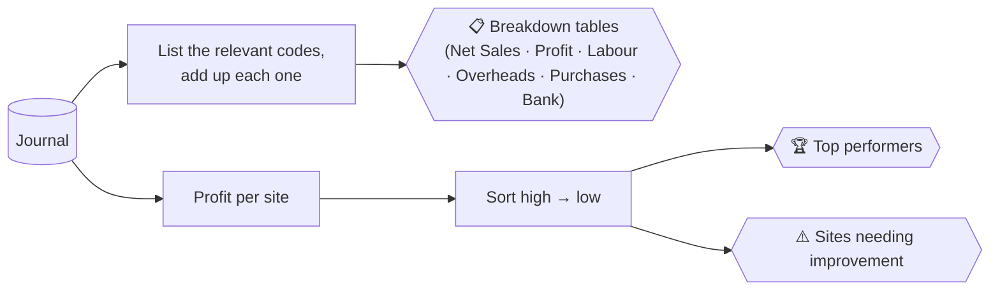

| Table | What it lists | Order |
|---|---|---|
| **Breakdown tables** | One row per nominal code with its total (Net Sales, Profit, Labour, Overheads, Purchases, Bank). | by code |
| **Site Rankings** | Each site's sales, profit, and PPL/margin. | profit, high → low (top 5 / bottom 5) |
| **Site-wise Fuel Volume** | Litres per site. | highest first |
| **Metrics Comparison** | Every headline number per site, side by side. | by chosen metric |

---

## 7. Comparison Flow (site vs site)

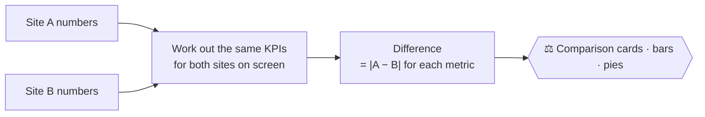

- Each site's profit, margin, labour %, volume, and PPL are rebuilt **in the browser** from the per-site responses.
- The comparison shows the **absolute difference** between the two sites for each metric (Sales diff, Profit diff, Volume diff).
- If neither site has volume data, the view automatically switches from **PPL** to **Margin %**.

---

## 8. Rules That Trip People Up

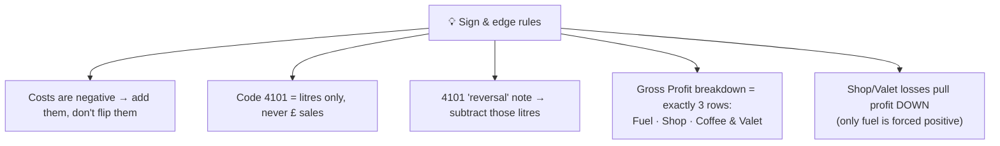

**Other quirks worth knowing:**
- Legacy `/api/dashboard/metrics` forces the total profit positive — this breaks the "losses subtract" rule; use the petrol-data routes for trustworthy profit.
- The "volume" field on a couple of by-site endpoints is actually a **£ amount**, not litres.
- All site postcodes are blank, so every site resolves to city *"unknown"* (the city map/list comes back empty).
- `petrol-data` *bunkered / non-bunkered breakdown* and the *status cards* are placeholders returning zeros.

---

*This file is a workflow/flow reference — for the exact code-level formulas, see the backend routes (`dashboard.js`, `petrolDataSage.js`, `sageDashboard.js`).*
